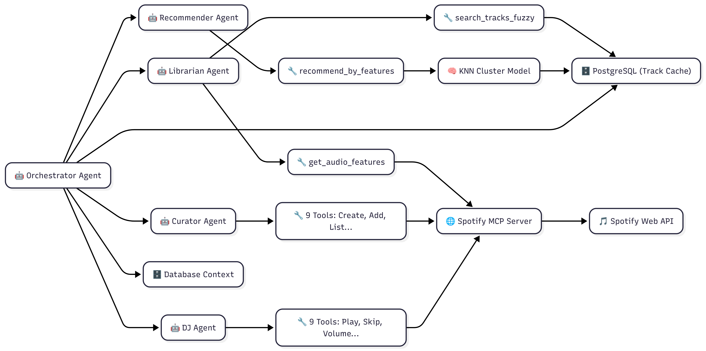

# Spotify Recs - Backend



O Backend do **Spotify Recs** é o "cérebro" do sistema, responsável por orquestrar a lógica de negócios, gerenciar agentes de IA e comunicar-se com serviços externos como o Spotify e Google Cloud.

Construído com **FastAPI** e **Python**, ele oferece uma API robusta e assíncrona para o frontend. Através da conexão com o [MCP Server](../spotify-mcp-server), ele fornece aos agentes de IA um conjunto de **ferramentas ("tools")** para pesquisar músicas, controlar o player (play, pause, next) e manipular playlists, permitindo que o modelo execute ações reais no Spotify em nome do usuário.

## 🚀 Tecnologias Utilizadas

- **[FastAPI](https://fastapi.tiangolo.com/)**: Framework web moderno e de alta performance para construção de APIs.
- **Python 3.12+**: Linguagem base do projeto.
- **[SQLAlchemy](https://www.sqlalchemy.org/)**: ORM para interação com o banco de dados.
- **[Alembic](https://alembic.sqlalchemy.org/)**: Gerenciamento de migrações de banco de dados.
- **[PostgreSQL](https://www.postgresql.org/)**: Banco de dados relacional e vetorial (via `pgvector`).
- **[Pydantic](https://docs.pydantic.dev/)**: Validação de dados e settings.
- **Machine Learning**: `scikit-learn`, `pandas`, `numpy` para recomendações e processamento de dados.
- **Google Cloud**: Integração com serviços de IA da Google (Gemini).
- **MCP (Model Context Protocol)**: Consumo de ferramentas do servidor MCP.

## ✨ Principais Funcionalidades

- **🤖 Orquestração de Agentes**: Sistema multi-agente que processa intenções do usuário (ex: "Toque algo animado", "Crie uma playlist") e decide quais ações tomar.
- **🔐 Autenticação e Segurança**: Gerenciamento de usuários, tokens JWT e segurança de endpoints.
- **🎵 Recomendação Inteligente**: Algoritmos de ML para sugerir faixas baseadas em vetores de características de áudio (danceability, energy, etc.).
- **📡 Conexão SSE com MCP**: Mantém uma conexão persistente com o servidor MCP para execução de comandos no Spotify em tempo real.

## 📦 Instalação e Execução

### Via Docker (Recomendado)

A execução principal é orquestrada via Docker. Consulte o repositório de infraestrutura:

👉 **[https://github.com/Rhogger/spotify-agentic-system-infra](https://github.com/Rhogger/spotify-agentic-system-infra)**

### Desenvolvimento Local

1. Instale as dependências (recomendado usar `venv` ou `pipenv`):
   ```bash
   pip install -r requirements.txt
   ```

2. Configure as variáveis de ambiente:
   Copie o `.env.example` para `.env` e preencha as credenciais do banco de dados e chaves de API.

3. Execute as migrações do banco:
   ```bash
   alembic upgrade head
   ```

4. Inicie o servidor:
   ```bash
   uvicorn app.main:app --reload --port 8000
   ```
   
   A documentação interativa (Swagger UI) estará disponível em `http://localhost:8000/api/docs`.

## 📂 Estrutura do Projeto

- `app/api`: Definição de rotas e endpoints da API.
- `app/agents`: Lógica dos agentes de IA e seus fluxos (Graphs/LangChain).
- `app/core`: Configurações globais, segurança e conexão com banco de dados.
- `app/models`: Modelos ORM (SQLAlchemy) que refletem as tabelas do banco.
- `app/schemas`: Schemas Pydantic para validação de entrada/saída (DTOs).
- `app/services`: Regras de negócio e lógica de serviço.
- `alembic/`: Scripts de migração de banco de dados.
