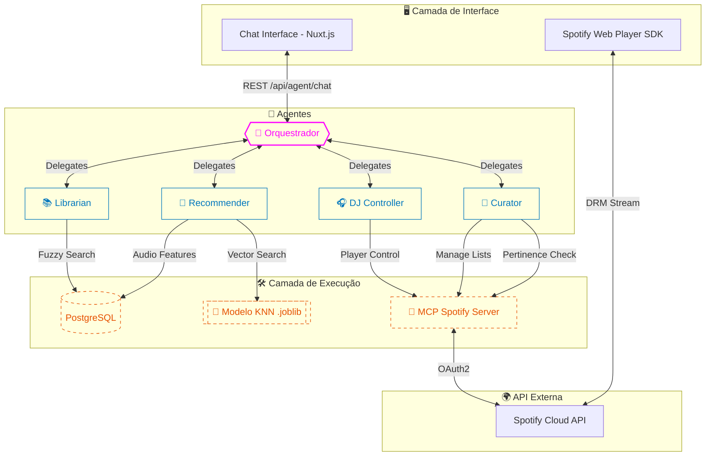

# 🤖 Arquitetura Agêntica e Integração de Chat

Este documento consolida a arquitetura do sistema de agentes, as ferramentas disponíveis, as interações entre os componentes e a documentação da API de Chat para integração com o Frontend.

---

## 🎨 Visão Geral da Arquitetura

O sistema utiliza o **Google Agent Development Kit (ADK)** para orquestrar agentes especialistas que interagem com o banco de dados local (PostgreSQL), um modelo de Machine Learning (KNN) e a API do Spotify via **Model Context Protocol (MCP)**.



---

## 👥 Agentes Especialistas

Cada agente possui uma responsabilidade única e ferramentas específicas para cumprir sua missão:

| Agente | Responsabilidade | Principais Ferramentas |
| :--- | :--- | :--- |
| **Orquestrador** | Roteamento e Planejamento | Nenhuma (Coordena os demais) |
| **Librarian** | Busca de Catálogo | `search_tracks_fuzzy` |
| **DJ Controller** | Controle de Reprodução | `play_music`, `set_volume`, `skip_to_next` |
| **Curator** | Gestão de Coleção | `create_playlist`, `add_to_playlist`, `find_playlists_containing_track` |
| **Recommender** | Descoberta (Vibe) | `recommend_by_features` |

### Interação entre Agentes (Exemplo)
Quando o usuário pede: *"Recomende algo parecido com Metallica e adicione na minha playlist 'Rock'"*:
1.  **Orquestrador** identifica as tarefas.
2.  **Librarian** busca os metadados e IDs do Metallica no DB.
3.  **Recommender** usa esses dados para gerar recomendações via KNN.
4.  **Curator** pega os IDs gerados e os adiciona na playlist solicitada via MCP.
5.  **Orquestrador** consolida a resposta final.

---

## 💬 API de Chat (Frontend ↔ Backend)

O frontend interage com o sistema através de um endpoint unificado.

### 1. Enviar Mensagem
- **URL**: `/api/agent/chat`
- **Método**: `POST`
- **Payload**:
```json
{
  "message": "Toque músicas agitadas de Rock"
}
```

### 2. Formato da Resposta (ChatResponse)
Diferente de um chat comum, a resposta pode conter metadados para renderização de cards ricos.

```json
{
  "response": "Encontrei estas músicas perfeitas para você...",
  "tracks": [
    {
      "spotify_id": "...",
      "name": "...",
      "artists": "...",
      "image_url": "...",
      "energy": 0.85
    }
  ],
  "playlists": [
    { "id": "...", "name": "...", "image": "..." }
  ]
}
```

### 3. Gestão de Sessão
Para limpar o histórico e resetar o contexto do agente:
- **URL**: `/api/agent/session/reset`
- **Método**: `POST`

---

## 🛠️ Detalhamento das Ferramentas (Tools)

As ferramentas são funções Python que os agentes invocam dinamicamente:

### Gerenciamento de Playlists (Curator)
- `list_my_playlists`: Lista as playlists do usuário.
- `get_playlist_tracks`: Lista faixas de uma playlist específica.
- `find_playlists_containing_track`: Verifica em quais playlists uma música específica está presente.

### Controle de Player (DJ)
- `play_music`: Inicia a reprodução.
- `set_shuffle` / `set_repeat_mode`: Altera configurações do player.
- `get_now_playing`: Retorna o contexto atual do que está tocando.

### Inteligência e Recomendação (ML)
- `recommend_by_features`: Recebe atributos como *energy* e *danceability* e retorna as faixas mais próximas estatisticamente no dataset.
