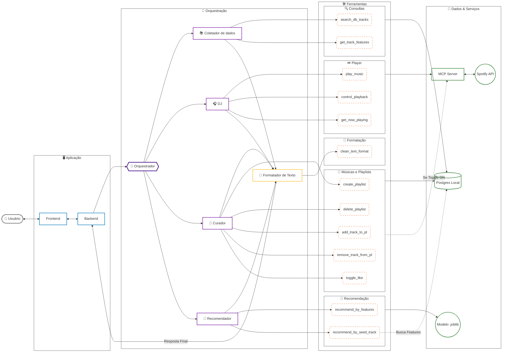

# 🔗 Fluxo de Dados e Conexões da Arquitetura Agêntica

Abaixo está o detalhamento das interações entre as camadas lógicas do sistema, descrevendo quem se comunica com quem e qual o propósito de cada conexão.

## 1. Camada de Aplicação e Entrada (User Interaction)

Gerencia a comunicação inicial e a interface com o usuário.

#### User ↔ Frontend

O usuário interage via chat (texto), enviando comandos (ex: "Toque Danding Dead de Avenged Sevenfold") e visualiza as respostas retornadas pelos agentes (através da API).

#### Frontend ↔ Backend

Comunicação via API REST. O Frontend envia o payload JSON com a mensagem e recebe streams de resposta ou objetos JSON finais.

#### Backend → Orquestrador

O servidor recebe a requisição, instancia a sessão do Google ADK e passa o contexto (histórico + mensagem atual) para o "Cérebro" (Router).

## 2. Camada de Orquestração

Onde a decisão de "qual especialista chamar" é tomada.

#### Orquestrador → Coletador de dados

Roteia a intenção quando o usuário busca informações factuais sobre o catálogo (ex: "Quantas músicas tem no banco?", "Quem canta X?").

#### Orquestrador → DJ

Roteia a intenção quando há desejo de controle de playback (ex: "Play", "Pause", "Pula", "O que está tocando?").

#### Orquestrador → Curador

Roteia a intenção de gerenciamento de biblioteca (ex: "Cria uma playlist", "Curte essa música").

#### Orquestrador → Recomendador

Roteia a intenção de descoberta e recomendação (ex: "Quero algo agitado", "Músicas parecidas com X").

> Nota: O Orquestrador nunca chama uma Tool diretamente, ele apenas delega para o Agente Especialista.

## 3. Execução de Ferramentas

O momento em que o Agente decide agir sobre algum evento.

#### Coletador de dados → T_Search (t1, t2)

O agente executa consultas SQL (search_db_tracks) ou busca metadados específicos (get_track_features) no banco local.

#### DJ → T_Player (t3...t5)

O agente envia comandos para controlar o Spotify Connect (play_music, control_playback) ou verificar o estado atual (get_now_playing).

#### Curador → T_Manage (t6...t10)

O agente manipula listas. Ele chama ferramentas para criar/deletar playlists, adicionar/remover faixas ou curtir/descurtir músicas.

#### Recomendador → T_ML (t11, t12)

O agente aciona o motor de inferência. Pode ser por features explícitas (recommend_by_features com "energy=0.8") ou por uma música passada como parâmetro (recommend_by_seed_track).

## 4. Interação com Recursos (Data & Services)

A camada física onde os dados residem ou as APIs externas são chamadas.

#### T_Search / T_Manage → Postgres Local

Todas as buscas de catálogo e modificações de playlists são primeiramente persistidas no banco de dados local para garantir cache e histórico próprio.

#### t12 (Seed) ⇢ Postgres Local

A ferramenta de recomendação por "semente" faz uma leitura prévia no banco para capturar o vetor de features da música alvo antes de chamar o modelo.

#### T_ML → Modelo .joblib

O serviço carrega o modelo K-Nearest Neighbors (KNN) treinado para calcular distâncias vetoriais e retornar os IDs das músicas mais próximas.

#### T_Player → MCP Server

Ferramentas de playback são enviadas via protocolo MCP (Stdio/JSON-RPC) para o servidor Node.js isolado.

#### T_Manage ⇢ MCP Server (Se Toggle ON)

Se o usuário optou por sincronizar, as ferramentas de gestão (create_playlist, toggle_like) também enviam o comando para o MCP replicar a ação no Spotify real.

#### MCP Server ↔ Spotify API

O servidor Node.js autenticado executa as chamadas HTTP finais para a Web API do Spotify.

## 5. Camada de Finalização (Output & Formatting)

Garante que o usuário receba uma resposta humana, não um JSON técnico.

#### Agentes (Todos) → Summarizer

Após executar suas ferramentas, os agentes enviam o resultado técnico (ex: "Track ID 123 added") para o Sumarizador.

#### Summarizer → t13 (clean_text_format)

O sumarizador usa esta tool para remover marcações Markdown quebradas ou formatar listas longas de forma elegante.

#### Summarizer → Backend (Resposta Final)

O texto processado e amigável (ex: "Prontinho! Adicionei 'Envolver' na sua playlist de Treino.") é devolvido para a API responder ao Frontend.
