# 🔗 Fluxo de Dados e Conexões da Arquitetura Agêntica

Abaixo está o detalhamento das interações entre as camadas lógicas do sistema, descrevendo quem se comunica com quem e qual o propósito de cada conexão.

```mermaid
flowchart LR
 subgraph App["🖥️ Aplicação"]
        Frontend["Frontend"]
        Backend["Backend"]
  end
 subgraph Brain["🧠 Orquestração"]
    direction TB
        Orchestrator{{"🤖 Orquestrador"}}
        Librarian["📚 Coletador de dados"]
        DJ["🎧 DJ"]
        Curador["🎻 Curador"]
        Recomendador["🧪 Recomendador"]
        Summarizer["📝 Formatador de Texto"]
  end
 subgraph T_Search["🔍 Consultas"]
        t1("search_db_tracks")
        t2("get_track_features")
  end
 subgraph T_Player["⏯️ Player"]
        t3("play_music")
        t4("control_playback")
        t5("get_now_playing")
  end
 subgraph T_Manage["📂 Músicas e Playlists"]
        t6("create_playlist")
        t7("delete_playlist")
        t8("add_track_to_pl")
        t9("remove_track_from_pl")
        t10("toggle_like")
  end
 subgraph T_ML["🔮 Recomendação"]
        t11("recommend_by_features")
        t12("recommend_by_seed_track")
  end
 subgraph T_Format["📄 Formatação"]
        t13("clean_text_format")
  end
 subgraph Toolbox["🛠️ Ferramentas"]
    direction TB
        T_Search
        T_Player
        T_Manage
        T_ML
        T_Format
  end
 subgraph External["💾 Dados & Serviços"]
    direction TB
        DB[("Postgres Local")]
        MCP["MCP Server"]
        ML(("Modelo .joblib"))
        Spotify(("Spotify API"))
  end
    User(["👤 Usuário"]) <--> Frontend
    Frontend <--> Backend
    Backend --> Orchestrator
    Orchestrator --> Librarian & DJ & Curador & Recomendador
    Librarian --> t1 & t2 & Summarizer
    DJ --> t3 & t4 & t5 & Summarizer
    Curador --> Summarizer & t6 & t7 & t8 & t9 & t10
    Recomendador --> Summarizer & t11 & t12
    Summarizer -- Resposta Final --> Backend
    Summarizer --> t13
    T_Search --> DB
    t12 -. Busca Features .-> DB
    T_ML --> ML
    T_Manage --> DB
    T_Manage -. Se Toggle ON .-> MCP
    T_Player --> MCP
    MCP <--> Spotify

     Frontend:::app
     Backend:::app
     Orchestrator:::orchestrator
     Librarian:::agent
     DJ:::agent
     Curador:::agent
     Recomendador:::agent
     Summarizer:::finalizer
     t1:::tool
     t2:::tool
     t3:::tool
     t4:::tool
     t5:::tool
     t6:::tool
     t7:::tool
     t8:::tool
     t9:::tool
     t10:::tool
     t11:::tool
     t12:::tool
     t13:::tool
     DB:::resource
     MCP:::resource
     ML:::resource
     Spotify:::resource
     User:::user
    classDef app fill:#e1f5fe,stroke:#0277bd,stroke-width:2px
    classDef orchestrator fill:#e1bee7,stroke:#4a148c,stroke-width:3px
    classDef agent fill:#f3e5f5,stroke:#7b1fa2,stroke-width:2px
    classDef tool fill:#fff3e0,stroke:#e65100,stroke-width:1px,stroke-dasharray:5,5
    classDef resource fill:#e8f5e9,stroke:#2e7d32,stroke-width:2px
    classDef finalizer fill:#fff9c4,stroke:#fbc02d,stroke-width:2px
    classDef user fill:transparent, stroke:#333, stroke-width:2px
    style Frontend fill:transparent
    style Backend fill:transparent
    style Orchestrator fill:transparent
    style Librarian fill:transparent
    style DJ fill:transparent
    style Curador fill:transparent
    style Recomendador fill:transparent
    style Summarizer fill:transparent
    style t1 fill:transparent
    style t2 fill:transparent
    style t3 fill:transparent
    style t4 fill:transparent
    style t5 fill:transparent
    style t6 fill:transparent
    style t7 fill:transparent
    style t8 fill:transparent
    style t9 fill:transparent
    style t10 fill:transparent
    style t11 fill:transparent
    style t12 fill:transparent
    style t13 fill:transparent
    style T_Search stroke:#424242,fill:transparent
    style T_Player fill:transparent,stroke:#424242
    style T_Manage stroke:#424242,fill:transparent
    style T_ML stroke:#424242,fill:transparent
    style T_Format stroke:#424242,fill:transparent
    style DB fill:transparent
    style MCP fill:transparent
    style ML fill:transparent
    style Spotify fill:transparent
    style User fill:transparent
    style App stroke:#424242,fill:transparent
    style Brain stroke:#424242,fill:transparent
    style Toolbox stroke:#424242,fill:transparent
    style External stroke:#424242,fill:transparent
```

## 1. Camada de Aplicação e Entrada (User Interaction)

Gerencia a comunicação inicial e a interface com o usuário.

#### User ↔ Frontend

O usuário interage via chat (texto), enviando comandos (ex: "Toque Danding Dead de Avenged Sevenfold") e visualiza as respostas retornadas pelos agentes (através da API).

#### Frontend ↔ Backend

Comunicação via API REST. O Frontend envia o payload JSON com a mensagem e recebe streams de resposta ou objetos JSON finais.

#### Backend → Orquestrador

O servidor recebe a requisição, instancia a sessão do Google ADK e passa o contexto (histórico + mensagem atual) para o "Cérebro" (Router).

## 2. Camada de Orquestração

Onde a decisão de "qual especialista chamar" é tomada.

#### Orquestrador → Coletador de dados

Roteia a intenção quando o usuário busca informações factuais sobre o catálogo (ex: "Quantas músicas tem no banco?", "Quem canta X?").

#### Orquestrador → DJ

Roteia a intenção quando há desejo de controle de playback (ex: "Play", "Pause", "Pula", "O que está tocando?").

#### Orquestrador → Curador

Roteia a intenção de gerenciamento de biblioteca (ex: "Cria uma playlist", "Curte essa música").

#### Orquestrador → Recomendador

Roteia a intenção de descoberta e recomendação (ex: "Quero algo agitado", "Músicas parecidas com X").

> Nota: O Orquestrador nunca chama uma Tool diretamente, ele apenas delega para o Agente Especialista.

## 3. Execução de Ferramentas

O momento em que o Agente decide agir sobre algum evento.

#### Coletador de dados → T_Search (t1, t2)

O agente executa consultas SQL (search_db_tracks) ou busca metadados específicos (get_track_features) no banco local.

#### DJ → T_Player (t3...t5)

O agente envia comandos para controlar o Spotify Connect (play_music, control_playback) ou verificar o estado atual (get_now_playing).

#### Curador → T_Manage (t6...t10)

O agente manipula listas. Ele chama ferramentas para criar/deletar playlists, adicionar/remover faixas ou curtir/descurtir músicas.

#### Recomendador → T_ML (t11, t12)

O agente aciona o motor de inferência. Pode ser por features explícitas (recommend_by_features com "energy=0.8") ou por uma música passada como parâmetro (recommend_by_seed_track).

## 4. Interação com Recursos (Data & Services)

A camada física onde os dados residem ou as APIs externas são chamadas.

#### T_Search / T_Manage → Postgres Local

Todas as buscas de catálogo e modificações de playlists são primeiramente persistidas no banco de dados local para garantir cache e histórico próprio.

#### t12 (Seed) ⇢ Postgres Local

A ferramenta de recomendação por "semente" faz uma leitura prévia no banco para capturar o vetor de features da música alvo antes de chamar o modelo.

#### T_ML → Modelo .joblib

O serviço carrega o modelo K-Nearest Neighbors (KNN) treinado para calcular distâncias vetoriais e retornar os IDs das músicas mais próximas.

#### T_Player → MCP Server

Ferramentas de playback são enviadas via protocolo MCP (Stdio/JSON-RPC) para o servidor Node.js isolado.

#### T_Manage ⇢ MCP Server (Se Toggle ON)

Se o usuário optou por sincronizar, as ferramentas de gestão (create_playlist, toggle_like) também enviam o comando para o MCP replicar a ação no Spotify real.

#### MCP Server ↔ Spotify API

O servidor Node.js autenticado executa as chamadas HTTP finais para a Web API do Spotify.

## 5. Camada de Finalização (Output & Formatting)

Garante que o usuário receba uma resposta humana, não um JSON técnico.

#### Agentes (Todos) → Summarizer

Após executar suas ferramentas, os agentes enviam o resultado técnico (ex: "Track ID 123 added") para o Sumarizador.

#### Summarizer → t13 (clean_text_format)

O sumarizador usa esta tool para remover marcações Markdown quebradas ou formatar listas longas de forma elegante.

#### Summarizer → Backend (Resposta Final)

O texto processado e amigável (ex: "Prontinho! Adicionei 'Envolver' na sua playlist de Treino.") é devolvido para a API responder ao Frontend.
