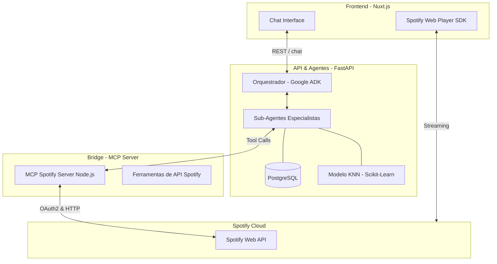

# Arquitetura do Sistema - Spotify Agentic System

Este documento detalha a arquitetura técnica do Spotify Agentic System, um ecossistema projetado para interação em linguagem natural com o Spotify, utilizando agentes de IA coordenados.

## Visão Geral

O sistema é dividido em três camadas principais: a camada de **Interface (Client)**, a camada de **Inteligência e API (Backend)** e a camada de **Execução Técnica (MCP Context)**.

---

## 1. Camada de Inteligência (Google ADK)

A inteligência reside no uso do **Google Agent Development Kit (ADK)**, que permite a criação de agentes modulares e orientados a código.

- **Orquestrador Central**: Atua como o "Cérebro". Ele recebe a entrada do usuário, planeja a sequência de ações e delega tarefas para os sub-agentes. Ele garante que a resposta final seja humanizada e natural.
- **Sub-Agentes Especialistas**:
    - **Librarian (Bibliotecário)**: Especialista em busca. Utiliza PostgreSQL com extensão `pg_trgm` para realizar buscas *fuzzy* (aproximadas) no catálogo local de músicas (mais de 170k faixas).
    - **Curator (Curador)**: Gerencia a biblioteca do usuário. Responsável por listar, criar e organizar playlists, além de verificar pertinência de músicas.
    - **DJ (Controlador)**: Responsável pelo controle de reprodução em tempo real (Play, Pause, Volume, Shuffle).
    - **Recommender (Recomendador)**: Utiliza um modelo de Machine Learning local para encontrar similaridade entre músicas.

---

## 2. Camada de API (FastAPI)

O backend é construído com **FastAPI**, servindo como a ponte robusta entre o frontend e a lógica de agentes.

- **Concorrência**: Utiliza `asyncio` nativamente para lidar com múltiplas chamadas aos Agentes e ao servidor MCP simultaneamente.
- **Autenticação**: Integração com OAuth2 do Spotify. O backend gerencia o ciclo de vida dos tokens (Access e Refresh Tokens), persistindo-os no PostgreSQL.
- **Gestão de Sessão**: Utiliza o `InMemorySessionService` do ADK para manter o contexto da conversa, permitindo que o usuário faça perguntas de acompanhamento (follow-up).

---

## 3. Camada de Execução (Model Context Protocol - MCP)

A execução de ações complexas no Spotify é feita através do **Model Context Protocol (MCP)**. Separamos a lógica de rede da lógica de inteligência.

- **MCP Spotify Server**: Um servidor independente construído em Node.js que implementa o protocolo MCP. Ele expõe "ferramentas" (Tools) que os agentes podem invocar dinamicamente.
- **Vantagem**: Os agentes não precisam conhecer detalhes da API do Spotify (endpoints, headers, etc). Eles apenas chamam ferramentas como `play_music` ou `add_to_playlist`.

---

## 4. Mecanismo de Recomendação

O sistema possui um motor de recomendação offline:

- **Modelo**: K-Nearest Neighbors (KNN).
- **Features**: Utiliza características de áudio técnicas (Energy, Valence, Danceability, Acousticness).
- **Processamento**: Os dados do usuário são normalizados e escalonados via Scikit-Learn antes de serem passados para o motor de busca vetorial.

---

## 5. Fluxo de Dados (Exemplo)

1.  **Usuário**: "Recomende algo parecido com Metallica e adicione na minha playlist 'Vibe'."
2.  **Orquestrador**: Identifica duas intenções (Recomendação e Gestão de Playlist).
3.  **Librarian**: Busca 'Metallica' no DB local para obter as *Audio Features*.
4.  **Recommender**: Recebe as *features* e gera uma lista de 20 músicas similares via KNN.
5.  **Curator**: Recebe as IDs das recomendações e chama a ferramenta `add_to_playlist` via MCP.
6.  **Orquestrador**: Consolida a resposta: "Criei as recomendações baseadas no estilo do Metallica e já as adicionei na sua playlist 'Vibe'!"